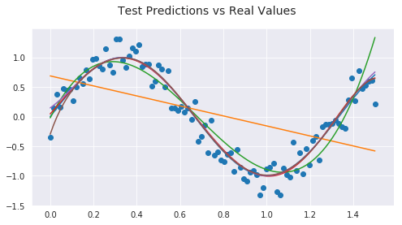
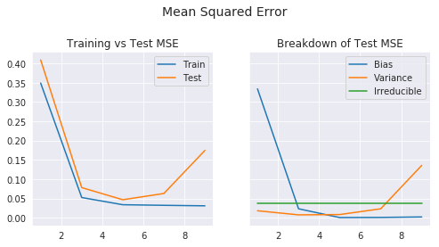
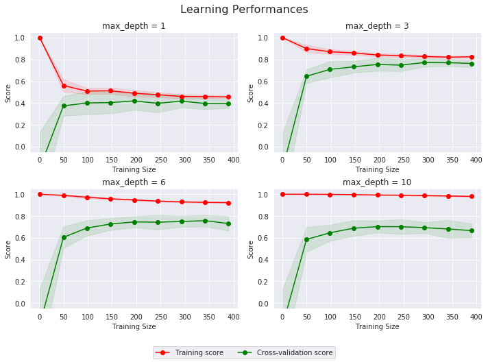

___

## Modeling Relationships

### Context

Suppose that we observe a quantitative response $Y$ and $p$ different predictors $X = X1, X2,...,Xp$. We assume that there is some relationship between them, which can be written in the very general form: 

$$Y = f(X) + \epsilon$$

+ $f$ is some fixed but unknown function of $X$.
+ $\epsilon$ is a random error term, which is independent of $X$ and has mean zero.

### Estimate function

We create an estimate $\hat{f}$ that predicts $Y$: $\hat{Y} = \hat{f}(X)$. There will always be two errors elements:

$$E (Y - \hat{Y}) = [f(X) - \hat{f}(X)]^{2} + Var(\epsilon)$$

Where:
+ $E (Y - \hat{Y})$ is the average squared error of predictions.
+ $[f(X) - \hat{f}(X)]^{2} $ is the reducible error. Our aim is to reduce this error.
+ $Var(\epsilon)$ is the irreducible error, that cannot be predicted using $X$.

### Predictions vs Inference

When focusing on **predictions accuracy**, we are not overly concern with the shape of $\hat{f}$, as long as it yields accurate predictions for $Y$: we treat it as a black box.

When focusing on **inference**, we want to understand the way that $Y$ is affected as $X$ changes, so we cannot treat $\hat{f}$ as a black box:

+ Which predictors are associated with the response? Which ones are the most important?
+ What is the relationship between the response and each predictor: positive or negative? Is there covariance?
+ Can the relationship between $Y$ and each predictor be adequately summarized using a linear equation, or is the relationship more complicated?

___

## Parametric vs Non-Parametric Methods

### Parametric Models

1. We make an **assumption about the functional form**, or shape, of $f$, the simplest of which is that it is linear.
2. We fit the model to a training set. It finds the values of the function's parameters that match $Y_{train}$ more closely.

Example for a linear model:
1. $f(X) = \beta_0 + \beta_1 X_1 + \beta_2 X_2 + ... + \beta_p X_p$.
2. Find values of $\beta_0, ..., \beta_p$ that minimizes the gaps between $\hat{Y}_{train}$ and $Y_{train}$.

The potential disadvantage of a parametric approach is that the model we choose will usually **not match the true unknown form of $f$**. 

+ If the chosen model is too far from the true $f$, then our estimate will be poor (underfitting). 
+ We can fit a more flexible model, that can fit different possible functional forms, but that:
    + requires estimating a greater number of parameters.
    + can lead to following the noise to closely (overfitting).

### Non-Parametric Models

Non-parametric methods **do not make explicit assumptions about the functional form** of $f$. Instead they seek an estimate of $f$ that gets as close to the data points as possible, without being too rough.

While non-parametric approaches avoid the issues of parametrics assumptions, they suffer from a major disadvantage: since they do not reduce the problem of estimating $f$ to a small number of parameters, a **very large number of observations** (far more
than is typically needed for a parametric approach) is required in order to obtain an accurate estimate for $f$.

### Trade-off

+ **Linear models** allow for relatively **simple and interpretable** inference, but may not yield as accurate predictions as some other approaches. 
+ Highly **non-linear** approaches may provide predictions that are **more accurate**, but this comes at the expense of **less interpretability**.

___

## Quality of Fit - Bias vs Variance

A good model **accurately predicts** the desired target value for **new data**. It will have:
+ low **bias**: how well the model approximates the data.
+ low **variance**: how stable the model is in response to new training examples

### Bias

It refers to the error that is introduced by **approximating a real-life problem**, which may be extremely complicated, by a **much simpler model**.

+ does the model capture the **relevant relations** between features and target outputs?
+ quantifies the average difference to be expected between an estimator and an underlying parameter.

*See also this link on [Inductive Bias](https://en.m.wikipedia.org/wiki/Inductive_bias).*

### Variance

It refers to the **amount** by which our **model would change** if we estimated it using a **different training set**.

+ does the model **ignore the random noise** in the training data?
+ quantifies the spread of estimator values around their mean. 

### Visual Representation

The figure below illustrates the range of predictions for a given input by a model trained with different datasets, depending on its bias and variance _([source](http://scott.fortmann-roe.com/docs/BiasVariance.html))_:


### Trade-off

There is no escaping the relationship between bias and variance in machine learning.

+ Increasing the bias will decrease the variance.
+ Increasing the variance will decrease the bias.

_Note: More complex models have typically less bias, at the risk of modelling more noise from the training set and therefore suffer from higher variance._

### Example

A model:
+ **underfits** when it does not fit the data well _(ex: degree 1)_. 
+ **overfits** when it does not generalizes well to out-of-sample data _(ex: degree 15)_
+ is a **good fit** when it captures the underlying true function well, without trying to model the noise _(ex: degree 4)_

We can link under- vs overfitting to bias and variance:
+ the **underfitting** model does not capture the relevant relations between features and outputs: it suffers from **high bias**.
+ the **overfitting** model captures the underlying noise in the training set, so changing the training set will lead to vastly different predictions: it suffers from **high variance**.


```python
from IPython.core.display import display, HTML
display(HTML('<style>body {font-family: Helvetica;}</style>'))
```


<style>body {font-family: Helvetica;}</style>


```python

## Import libraries necessary for this project

import numpy as np
import pandas as pd

import seaborn as sns
import matplotlib.pyplot as plt


from sklearn.metrics import r2_score

## custom modules
import helpers.boston_visuals as vs
import helpers.overunderfitting as ov


## plotting layout setup
sns.set_style(style='darkgrid')
%matplotlib inline
    
## auto reload of custom modules
%load_ext autoreload
%autoreload 2

```

    The autoreload extension is already loaded. To reload it, use:
      %reload_ext autoreload
    


```python
overunderfitting_example()
```


### Further Reading

+ [Different meanings of bias](https://www.quora.com/What-is-bias-in-machine-learning-algorithms)
+ [Read N°1 on biased data](https://towardsdatascience.com/preventing-machine-learning-bias-d01adfe9f1fa)
+ [Read N°2 on biased data](https://towardsdatascience.com/identifying-and-correcting-label-bias-in-machine-learning-ed177d30349e)

*Note: The illustration of overfitting vs underfitting comes from [here](https://scikit-learn.org/stable/auto_examples/model_selection/plot_underfitting_overfitting.html).*

___

## Shuffle and Split Data

### Train / Test Sets

We prepare the dataset for training the model:

+ randomly shuffle data, in order to remove any bias that could stem from the original ordering of the dataset.
+ split the dataset into training and testing subsets. Using a `random_state` ensures the split is always the same.


Why split a dataset into some ratio of training and testing subsets?

+ Our goal is to estimate likely performance of a model on out-of-sample data.
+ But, maximizing training accuracy rewards overly complex models that overfit the training data.
+ Testing accuracy is a better estimate of out-of-sample performance.


### K-Fold Cross-Validation


Limitations of train/test split:

+ Testing accuracy can change a lot depending on a which observation happen to be in the testing set: it has a **high variance**.
+ Using **K-fold cross-validation** helps mitigate this problem (see illustration below):
    + the dataset is divided in K subsets of equal size called "folds".
    + the model is trained K times, each run holding out a different fold as test set.
    + the average testing score is used as an estimate of out-of-sample performance.
+ This is especially useful for hyperparameters tuning, as it avoids combinations that overfit the training set.


More information about Cross-Validation can be found [here](https://scikit-learn.org/stable/modules/cross_validation.html).

___

## Prediction Error

### Definition

The figure below shows the relationship between model complexity and training/validation errors. The optimal model has the **lowest generalization error**, and is marked by a dashed line.

+ A model that is **too simple** will not predict either set accurately: **both training & validation errors** will be **high** *(left)*.
+ A model that is **too complex** will capture the noise in the training set and generalize poorly: its **validation error** will be **much higher** *(right)*.


### Mathematical Expressions

In the regression setting, the most commonly-used measure is the **mean squared error (MSE)**. 

The **expected MSE of a given observation $x_0$** refers to the average test MSE that we would obtain if we repeatedly estimated $f$ using a **large number of training sets**, and tested each at $𝑥_0$. 

$$\operatorname{E}\Big[\big(y_0 - \hat{f}(x_0)\big)^2\Big] = \Big(\operatorname{Bias}\big[\hat{f}(x_0)\big] \Big) ^2 + \operatorname{Var}\big[\hat{f}(x_0)\big] + \operatorname{Var}(\epsilon)$$

$\operatorname{Bias}\big[\hat{f}(x_0)\big] = \operatorname{E}\big[\hat{f}(x_0)\big] - f(x_0)\qquad\qquad$ _Bias = Average Error_

$\operatorname{Var}\big[\hat{f}(x_0)\big] = \operatorname{E}\big[\hat{f}(x_0)^2\big] - \operatorname{E}\big[{\hat{f}}(x_0)\big]^2\qquad$ _Variance = Average Variation of the Prediction around its Mean_

$\operatorname{Var}(\epsilon)\qquad\qquad\qquad\qquad\qquad\qquad\qquad$ _Irreducible Error = Variance of the Random Error Term_

+ _Note1: The **overall expected value** can be computed by averaging the expected value of all $x_0$ in the data set._
+ _Note2: It is not possible to properly split the training MSE because the training set is different for each iteration of the training process._

### Example

We can break down the Test MSE for a simple example where we know:

+ the true underlying function $f$.
+ the irreducible error $\operatorname{Var}(\epsilon)$, which corresponds to the lowest achievable test MSE.

_Note: In a real-life situation in which $f$ is unobserved, it is generally not possible to explicitly compute the test MSE, bias, or variance for a statistical learning method. We can use cross-validation to estimate the test MSE using the training data._


```python
## example of over- and underfitting polynomial models for a simple function
degrees = range(1, 11, 2)
ouf_cos = ov.OverUnderFit(true_func='cos')
ouf_cos.overunderfitting_example(degrees=degrees, test_size=50, n_iterations=100)
```








___

## Learning Curves

*Note: a list of scorers is available [here](https://scikit-learn.org/stable/modules/model_evaluation.html).*

### Example

We test the performance of a decision tree model with four different maximum depths. The learning curves show the R<sup>2</sup> for both training and testing sets, as the training set gets larger. More info on learning curves can be found [here](https://scikit-learn.org/stable/modules/learning_curve.html).

_Note: the shaded region of a learning curve denotes the uncertainty of that curve (measured as one standard deviation)._


```python
## Produce learning curves for varying training set sizes and maximum depths
boston = vs.ModelSelector()
boston.ModelLearning()
```





### High Bias Scenario

A model suffers from high bias (underfitting) when the model does not fit the data well:
    
+ the training score quickly decreases when the training size increases, towards a low value.
+ the testing score rapidly converges towards the low training score.

In these instances *(as seen above when max_depth=1)*, collecting more data points will likely not benefit the model.

### High Variance Scenario

A model suffers from high variance (overfitting) when the model does not generalizes well to out-of-sample data:
    
+ the training score stays very high, even when the training size increases.
+ the testing score never reaches a very high value.

In these instances *(as seen above when max_depth=10)*, collecting more data points might help limit the overfitting.

### Ideal Scenario

The ideal scenario shows the testing score getting closer to the training score as the training size increases, towards a high value. *This is seen above when max_depth=3, and to a lesser extent when max_depth=6.*

___

## Validation Curves

### Example

We test the performance of a decision tree model with various maximum depths. The learning curves show the R<sup>2</sup> for both training and testing sets, as the maximum depth increases. More information on validation curves can be found [here](https://scikit-learn.org/stable/modules/learning_curve.html##validation-curve).

_Note: using grid search is typically more suited to identifying optimal hyperparameters values._


```python
boston.ModelComplexity()
```


### Bias - Variance Tradeoff

As shown in the validation curves, the model behavior depends on the maximum depth:

+  1: underfits the data. Both train and test scores are low.
+  4: fits the data the best. It has the highest test score, that is close to the train score.
+ 10: overfits the train set and does not generalize well.

___

## Improving Models

### General Strategy

+ large sample size, few features: a flexible model would fit the data better; the large sample size will limit the overfitting.
+ small sample size, large amount of features: a flexible model would probably overfit the training set.
+ large variance of the error term: a flexible model would probably capture the noise and generalize poorly.

### High Bias

Training error will also be high. Potential solutions:

+ Add new features.
+ Add more complexity by introducing polynomial features.

### High Variance

Training error will be much lower than test error. Potential solutions:

+ Increase training size.
+ Reduce number of features, especially those with weak signal to noise ratio.
+ Increase Regularization terms.

___

## Regularization Terms

Regularization aims to prevent overfitting by penalizing large weights when training the model. It adds a regularization term to the loss function, with a regularization parameter called $\lambda$.

### L1 Regularization - LASSO

+ L1 regularization penalizes the absolute value of the weights. 
+ It can do feature selection: insignificant input features are assigned a weight of zero.
+ The resulting models are simple and interpretable, but cannot learn complex patterns.

### L2 Regularization - Ridge Regularization

+ L2 regularization penalizes the square of the weights. 
+ It forces the weights to be small but not zero.
+ Taking squares into account makes it sensititive to outliers.
+ It is able to learn complex data patterns.

### ElasticNet

ElasticNet linearly combines the L1 and L2 penalties of the lasso and ridge methods.


*See also [this link](https://medium.com/datadriveninvestor/l1-l2-regularization-7f1b4fe948f2) for more information.*

___

## Features Selection

A few methods can be [used](https://scikit-learn.org/stable/modules/feature_selection.html) to reduce the number of features and decrease the risks of overfitting:

+ Remove features with low variance.
+ Univariate selection: only keep features that correlate highly with the outcome feature.
+ Regressive feature elimination: only keep the features that lead to the most accurate model in CV. 
+ LASSO: only keep features with non-null weigths.
+ Tree-based features importance.

___

## Hyperparameters Tuning

More information on hyperparameters tuning can be found [here](https://scikit-learn.org/stable/modules/grid_search.html).

In the **[GridSearchCV](https://scikit-learn.org/stable/modules/generated/sklearn.model_selection.GridSearchCV.html)** technique, we define a range of values for every parameter we want to tune. The Grid Search will train models for each combination of values using K-fold CV, then outputs the compared performances.

This technique can become VERY resource-intensive for large datasets. In might be better to use **[RandomizedSearchCV](https://scikit-learn.org/stable/modules/generated/sklearn.model_selection.RandomizedSearchCV.html)** in those instances.

___

## Important Resources

+ [Introduction to Statistical Learning](https://www-bcf.usc.edu/~gareth/ISL/ISLR%20Seventh%20Printing.pdf) _(link to downlad the .pdf version)_
+ [Interpretable Machine Learning](https://christophm.github.io/interpretable-ml-book/) _(github.io based e-book)_

+ bias / variance: what / impact / how to measure?
+ loss function: how to define?
+ cross-validation: when / purpose?
+ R² vs adjusted-R²: when / good choice?
+ R² vs adjusted-R² on random noise

+ feature importance: train or test set?

Links to double-check:

+ https://en.m.wikipedia.org/wiki/Bias%E2%80%93variance_tradeoff
+ http://scott.fortmann-roe.com/docs/MeasuringError.html
+ http://cs229.stanford.edu/materials/ML-advice.pdf
